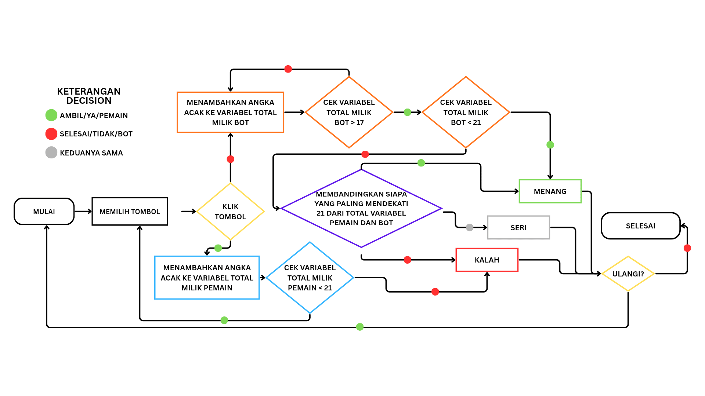

# ENGLISH
## Purpose
To simply put, this is actually for my school project. I made this using ChatGPT at first, but then i remake it so i can understand every functions and add some improvements in it.
## Group members
- Muhammad Putra Anugrah Deliano
- Cakra Tri Saddha
## How i made this?
So at first, my teacher, Miss Ida, who taught me Informatics, gave me an assignment to make simple algorithm using flowcharts. Long story short, i've done the assignment. But then it got me thinking, what if i made this assignment a real little project? So i asked ChatGPT to create simple blackjack based on flowchart that i made then he made it, but i don't know what is going on so i just try to remake it, add some improvement, and voíla, this simple game is made.

# INDONESIAN
## Tujuan
Simpelnya gini, ini itu untuk proyek sekolah gue. Awalnya gue bikin pake ChatGPT lalu remake supaya gue lebih ngerti mengenai fungsi-fungsi dan menambahkan beberapa peningkatan.
## Anggota kelompok
- Muhammad Putra Anugrah Deliano
- Cakra Tri Saddha
## Kenapa gue bikin ini?
Awalnya, guru gue, Bu Ida, yang ngajarin gue Informatika ngasih gue tugas untuk bikin algoritma simpel menggunakan flowchart. Singkat cerita, gue sudah ngerjain tugas itu. Lalu gue memiliki ide, bagaimana jika gue bikin proyek asli berdasarkan tugas ini? Jadi gue nanya ChatGPT untuk membuat permainan blackjack simpel berdasarkan flowchart yang gue bikin, tapi gue gak tau apa fungsi-fungsinya jadi gue nyoba bikin ulang, tambah upgrade, dan akhirnya permainan simple ini jadi.

# FLOWCHART (INDONESIAN ONLY)

